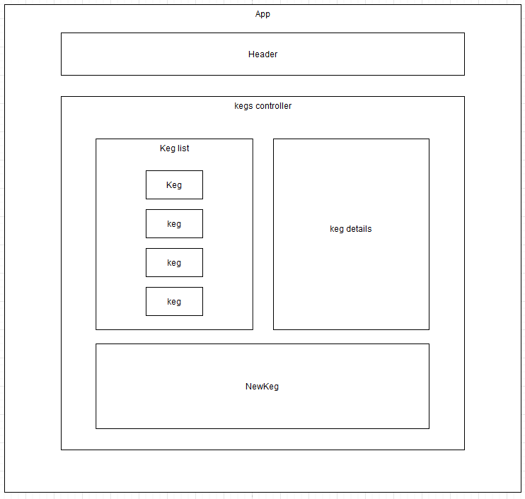

# _Tap Room_

#### _A React built tap room now featuring Redux_

#### By _James Wyn_

## Description
This little program allows users to add, sell and remove kegs of beer from a tap room - now with React implementation

## Component Diagram



## Specs
```
describe("formVisibleReducer", () => {

  test('Should return default state if no action type is recognized', () => {
    expect(formVisibleReducer(false, { type: null })).toEqual(false);
  });

  test('Should toggle form visibility state to true', () => {
    expect(formVisibleReducer(false, { type: 'TOGGLE_FORM' })).toEqual(true);
  });
});

```
```
describe("kegListReducer", () =>
{
  const currentState = {
    1: {
      name: "RPM",
      brand: "Boneyard",
      price: "5",
      alcohol: "7.2",
      id: 1
    },
    2: {
      names: "Outburst",
      brand: "Pyramid",
      price: "3",
      alcohol: "8.6",
      id: 2
    }
  }

  let action;
  const kegData = {
    name: "RPM",
    brand: "Boneyard",
    price: "5",
    alcohol: "7.2",
    id: 1
  };

  test("Should correctly add new keg data to masterKegList", () =>
  {
    const { name, brand, price, alcohol, id } = kegData;
    action = {
      type: "ADD_KEG",
      name: name,
      brand: brand,
      price: price,
      alcohol: alcohol,
      id: id
    };

    expect(kegListReducer({}, action)).toEqual({
      [id]: {
        name: name,
        brand: brand,
        price: price,
        alcohol: alcohol,
        id: id
      }
    })
  })

  test("Should return default state if there is no action type passed into the reducer", () =>
  {
    expect(kegListReducer({}, { type: null })).toEqual({})
  });

  test("Should successfully delete a keg", () =>
  {
    action = {
      type: "DELETE_KEG",
      id: 1
    };
    expect(kegListReducer(currentState, action)).toEqual({
      2: {
        names: "Outburst",
        brand: "Pyramid",
        price: "3",
        alcohol: "8.6",
        id: 2
      }
    })
  })
});
```


## Setup and Use

### Installation
1. Clone the repository: `$ git clone https://github.com/Thisisjameswyn/Tapit-Redux`
2. Install node modules with `$ npm install`

### Build and Run
1. Use `$ npm run start` to start the server.
2. It should autmoatically open the corrent site, but if it doesn't navigate to http://localhost:3000

## Known Bugs
There were no bugs found

## Technologies Used
* React
* Redux
* JS

### License

MIT

Copyright (c) 2021 _James Wyn_